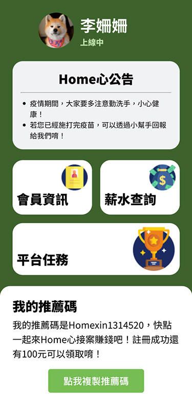
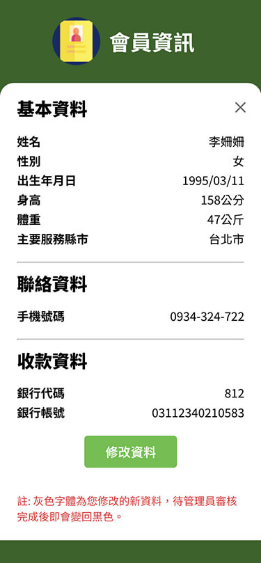
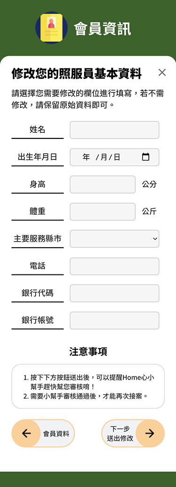

## Homexin Member App

My first React App, built with React, JSX, JavaScript, and CSS.

## Project Screen Shots

## Installation and Setup Instructions

Clone down this repository. You will need node and npm installed globally on your machine.

Installation:

> npm install

To Run Test Suite:

> npm test

To Start Server:

> npm start

To Visit App:

> localhost:3000

## Reference Document

###### React Router

https://www.npmjs.com/package/react-router-dom
https://reactrouter.com/docs/en/v6/getting-started/tutorial

###### readme-template

https://gist.github.com/martensonbj/6bf2ec2ed55f5be723415ea73c4557c4

###### How to Write a Git Commit Message

https://blog.louie.lu/2017/03/21/%E5%A6%82%E4%BD%95%E5%AF%AB%E4%B8%80%E5%80%8B-git-commit-message/
